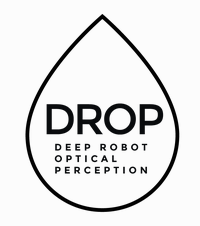

<!-- First Row -->
<table>
  <tr>
    <td valign="top" style="text-align: left;"></td>
    <td>
      <strong>Undergraduate Researcher @ DROP Lab</strong> 
      Jan 2024 - Present
      Pittsburgh, PA 
      <ul>
        <li>Developing robust <strong>robotic perception and planning system</strong> including the following projects:</li>
        <ol>
          <li>Precise and fast <strong>3D point cloud reconstruction from monocular camera</strong></li>
          <li><strong>Handheld object pose estimation</strong> based on gradient optimization</li>
          <li><strong>3D point cloud surface segmentation</strong> based on 2D segmentation for environment understanding</li>
          <li>Novel and high-performance arm <strong>control and planning</strong></li>
          <li>Robust and efficient quadruped <strong>sim-to-real pipeline</strong></li>
        </ol>
      </ul>
      See some results of these projects in <a href="/publications/">Publications</a>
    </td>
  </tr>
</table>

<!-- Second Row -->
<table>
  <tr>
    <td valign="top" style="text-align: left;"></td>
    <td>
      <strong>Research Intern @ Microsoft Research Asia</strong> 
      May 2024 - August 2024
      Beijing 
      <ul>
        <li>Received Microsoft Stars of Tomorrow Award.</li>
        <li><strong>Research Projects (2)</strong>:
          <ul>
            <li>Worked on transformer-based LLM mechanisms and alignments</li>
            <li>Developed LLM applications</li>
          </ul>
        </li>
        <li><strong>Industry Projects (3)</strong>:
          <ul>
            <li>Engineered image (visual) embedding</li>
            <li>Improved system recall rate</li>
            <li>Reduced embedding dimensions for computing efficiency</li>
          </ul>
        </li>
      </ul>
    </td>
  </tr>
</table>

<!-- Third Row -->
<table>
  <tr>
    <td valign="top" style="text-align: left;"></td>
    <td>
      <strong>Teaching Assistant @ CMU SCS</strong> 
      Jan 2024 - Present
      Pittsburgh, PA 
      <ul>
      <li><strong>15210 Parallel and Sequential Data Structures and Algorithms</strong> (<a href="https://www.cs.cmu.edu/~15210/">Fall 24</a> & <a href="#">Spring 24</a>)</li>
      <li><strong>15122 Principles of Imperative Computation</strong> (<a href="http://www.cs.cmu.edu/~15122-archive/n23/">Summer 23</a>)</li>
      <li><strong>15112 Fundamentals of Programming and Computer Science</strong> (<a href="https://www.cs.cmu.edu/~112-s23/">Spring 23</a>)</li>
      </ul>
    </td>
  </tr>
</table>

